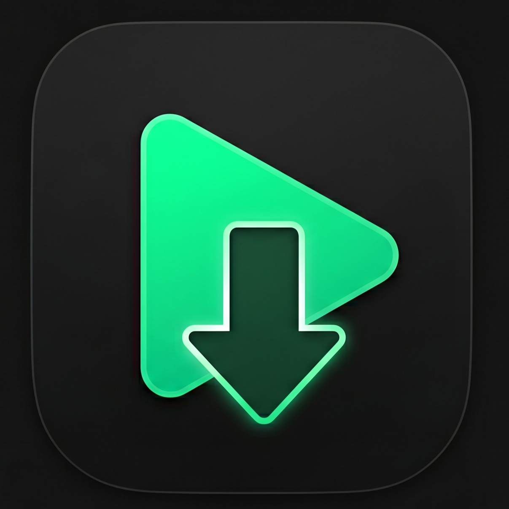

# Chzzk VOD Downloader v3

<div align="center">
  
  <p>치지직(Chzzk) 다시보기 및 클립을 다운로드할 수 있는 데스크톱 애플리케이션입니다.</p>
</div>

## ✨ 주요 기능

*   🚀 **초고속 병렬 다운로드 엔진**: TS(m3u8) 청크를 다중 스레드로 병렬 다운로드하여 네트워크 대역폭을 최대한 활용합니다.
*   ✂️ **무손실 영상 분할 및 추출**: 내장된 `ffmpeg`를 이용하여 원본 화질 손상 없이 영상을 N분 단위로 자르거나, 특정 구간(예: 00:10:00 ~ 00:15:00)만 추출하여 다운로드할 수 있습니다.
*   🔍 **채널 및 영상 검색 내장**: 앱 내에서 바로 스트리머의 채널을 검색하고, VOD(다시보기) 및 클립 목록을 확인하여 대기열에 추가할 수 있습니다.
*   🌐 **브라우저 확장프로그램 연동**: 제공되는 확장프로그램을 사용하면 치지직 웹사이트에서 시청 중인 영상을 원클릭으로 다운로더 앱에 전송할 수 있습니다.
*   ⚙️ **유연한 설정 및 편의 기능**: 비공식 API 차단에 대비한 원격 설정 URL 시스템, 다운로드 완료 후 PC 종료/절전 모드 전환, 19세 이상(성인) 콘텐츠 다운로드를 위한 네이버 로그인 세션(쿠키) 연동 등을 지원합니다.

---

## 🛠 구현 기술 스택

*   **Front-end (Renderer)**: Vanilla JS, HTML5, CSS3
*   **Back-end (Main)**: Node.js, Electron (데스크톱 네이티브 제어 및 로컬 HTTP 서버 구동)
*   **Media Processing**: `fluent-ffmpeg`, `ffmpeg-static` (크로스 플랫폼 미디어 가공)
*   **Network & Security**: Node.js `https` 모듈, Electron IPC 통신 (Context Isolation 및 CSP 엄격 준수)

---

## 📦 설치 및 사용 방법

### 1. 데스크톱 앱 다운로드
사용자의 편의에 따라 **설치 버전**과 **무설치(포터블) 버전** 중 하나를 선택하여 다운로드할 수 있습니다.
GitHub의 **[Releases]** 탭으로 이동하여 원하는 파일을 받으세요.

*   **설치 버전**: `Setup.exe`
    *   다운로드 후 실행하면 자동으로 바탕화면에 아이콘이 생성되며 설치됩니다.
    *   설치 진행에 시간이 너무 오래 걸리는 현상이 파악 되었습니다. 향후 수정 예정입니다. 그간에는 포터블 버전 이용을 권장합니다.
*   **무설치 포터블 버전 (권장) **: `portable.zip`
    *   설치 과정을 거치고 싶지 않다면 이 파일을 다운로드하세요.
    *   원하는 폴더에 압축을 푼 뒤, 폴더 안의 `Chzzk VOD Downloader.exe`를 실행하면 바로 사용 가능합니다.

### 2. 브라우저 확장프로그램 연동 (선택 사항)
치지직 시청 중 복사-붙여넣기 없이 버튼 하나로 다운로드하려면 확장프로그램을 설치하세요.
1. GitHub **[Releases]** 탭에서 `extension.zip` 파일을 다운로드하고, 원하는 폴더에 압축을 풉니다.
2. **Chrome (크롬) 또는 Edge (엣지)** 주소창에 `chrome://extensions/` 를 입력해 확장프로그램 관리 페이지로 들어갑니다.
3. 페이지 우측 상단의 **[개발자 모드]** 스위치를 켭니다.
4. 좌측 상단의 **[압축해제된 확장 프로그램을 로드합니다]** (Load unpacked) 버튼을 클릭합니다.
5. 앞서 압축을 해제한 `extension` 폴더를 선택하면 브라우저 우측 상단에 로고 아이콘이 추가되며 설치가 완료됩니다!
6. *참고: 앱 설정에서 **'로컬 서버 켜기(포트: 11025)'**가 체크되어 있어야 확장프로그램과 정상적으로 통신합니다.*
7. Firefox에서도 지원합니다. 주소창에 'about:debugging#/runtime/this-firefox'을 입력하고 임시 확장 기능 로드... (Load Temporary Add-on...)를 클릭한 후, manifest.json을 선택하면 됩니다.
---

## 📖 사용 가이드

**다운로드 경로 설정하기**
앱을 처음 실행한 뒤 메인 화면의 우측에 있는 버튼을 눌러 영상이 저장될 폴더를 지정해 주세요.

**URL로 직접 추가하기**
1. 다운로드 탭의 상단 입력창에 VOD나 클립의 URL을 붙여넣고 엔터를 누릅니다.
2. 해상도 및 분할 모드(전체/전체 분할/특정 구간)를 선택하고 대기열에 추가합니다.

**브라우저 확장프로그램으로 추가하기 (권장)**
1. 치지직 웹사이트(`chzzk.naver.com`)에서 다운로드하고 싶은 영상이나 클립 페이지에 접속합니다.
2. 화면 우측 하단에 떠 있는 **"⬇️ 앱으로 다운로드"** 초록색 버튼을 클릭합니다.
3. 백그라운드에 켜져 있던 다운로더 앱이 자동으로 활성화되며, 즉시 다운로드 창이 나타납니다.

**쿠키 설정 (19세 이상 콘텐츠)**
1. 앱 우측 상단의 **[설정]** 탭으로 이동합니다.
2. 본인의 네이버 계정으로 로그인된 브라우저(F12 개발자 도구 -> Application -> Cookies)에서 `NID_AUT`와 `NID_SES` 값을 찾아 복사하여 붙여넣습니다.

---

## 💻 개발자 직접 빌드 (소스코드)

Node.js 환경이 구축되어 있다면 소스코드를 직접 빌드할 수 있습니다.

```bash
# 의존성 패키지 설치
npm install

# 개발 모드로 앱 실행
npm run dev

# Windows(.exe) 배포 파일 생성 (dist 폴더에 생성됨)
npm run build
```

## 📜 라이선스 (License)

본 프로젝트는 오픈소스로 배포되며, GPL-3.0 라이선스를 따릅니다.
해당 프로그램은 https://github.com/honey720/chzzk-vod-downloader-v2 프로젝트를 기반으로 제작되었습니다.

## 면책 조항

- 해당 프로그램을 사용함으로써 발생하는 문제에 대해서는 개발자는 법적 책임을 지지 않습니다.

## 기타

- 해당 프로그램은 Google Antigravity (Gemini 및 Claude)를 사용하여 제작하였습니다. (~찬양하라~)
- 해당 프로젝트에 대한 건의사항, 문제점이 있다면 Issue 탭을 이용해 주세요.
